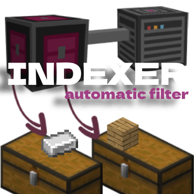

# Indexer Mod 
<a href="https://modrinth.com/mod/indexer" target="_blank">
  
</a>

<a href="https://www.curseforge.com/minecraft/mc-mods/indexer" target="_blank"> 
   
</a>


# [View Video](https://youtu.be/rm9Hx_9Qvbw?si=IMnWUiCvcO_cNHbx)
## Description
Indexer is a mod for Minecraft 1.21.1 (Fabric) that helps you organize and manage your items. This automation system allows you to filter and automatically distribute the contents of your Chests/Containers, eliminating the need to manually sort your resources.

With Indexer, you can deposit all your items in a central point and the system will take care of distributing them to the appropriate containers according to the filters you have configured, saving you time and keeping your base perfectly organized!

## Developer
- [AgustinBenitez](https://github.com/Agustinbeniteez)

## Main Components

### Indexer Controller
The brain of the entire system. Place this block at the center of your storage network and connect it to a DropBox (special container) where you'll deposit the items you want to sort. The Controller can detect connectors up to 250 blocks away, allowing you to create massive and complex storage systems.

### Indexer Pipe
These blocks connect the Indexer Controller with the Indexer Connectors, forming the distribution network. They are easy to craft and yield 10 units per recipe, allowing you to create extensive distribution systems with few resources.

### Indexer Connector
Place these blocks next to your chests, barrels, furnaces, or other containers. Each Connector can be configured with a specific filter to determine which items it will accept. Items that match the filter will be automatically sent from the Controller to the connected container.

### DropBox
A special container with 54 slots (double that of a normal chest) where you can deposit all the items you want to sort. The Indexer Controller will extract the items from here and distribute them according to the configured filters.

### Speed Upgrades
The system includes 5 speed upgrades with performance increases per level:

- Basic — 5x
  
  
  
  Crafting: gold ingots in the corners, redstone dust in the remaining slots, and an Indexer Controller in the center. Transfers up to 4 items per cycle.

- Copper — 10x
  
  
  
  Crafting: surround the Basic upgrade with copper ingots.

- Advanced — 20x
  
  
  
  Crafting: surround the Copper upgrade with diamonds. Transfers up to 16 items per cycle.

- Elite — 64x
  
  
  
  Crafting: surround the Advanced upgrade with `Netherite Scrap`.

- Definitive — 256x
  
  
  
  Crafting: final tier. Check the in-game recipe book if your pack includes its recipe.

Note: The “x” values represent the system’s relative performance multiplier. Exact items-per-cycle amounts are shown in the UI and in the Indexer Controller tooltips depending on the applied upgrade.

### Filters
Filters let you restrict or allow items routed through the Indexer network.

- Usage
  - Place filters in the connector’s filter slots to affect routing.
  - Right-click configurable filters to set their criteria (Name, Attribute, Custom Tag Blocker).
  - Multiple filters can be combined; specific filters (tools/food/fuel) allow only their category.

- Base Filter
  
  
  
  Core component used for crafting other filters.

- Name Filter
  
  
  
  Filters items by exact custom name. Right-click to set the target name.

- Attribute Filter
  
  
  
  Filters by attributes like enchantments. Right-click to set the attribute.

- Custom Tag Blocker
  
  
  
  Blocks items by ID/tag. Right-click to set the item/tag to block.

- Food Filter
  
  
  
  Allows only edible items.

- Fuel Filter
  
  
  
  Allows only fuel items (e.g., coal, charcoal, lava bucket in furnaces).

- Tools Filter
  
  
  
  Allows only tools: pickaxes, axes, shovels, hoes, and swords.

Crafting: most filters are crafted using the Base Filter plus category items. Check the in-game recipe book for exact patterns.

## Special Features

### Furnace Compatibility
The system automatically detects furnaces and can refill fuel (coal or charcoal) without additional configuration.

### Wide Range
The Controller can detect and manage connectors up to 250 blocks away, allowing you to create storage systems that span your entire base.

### No Limits
There is no restriction on the number of connectors you can use in your system, allowing you to expand it as much as you need.

### Intuitive Interface
Easily configure your connector filters with a simple and straightforward interface. Just place the item you want to filter in the available slot.

## New Indexer Controller UI

The Indexer Controller Network screen was redesigned to clearly show all connected containers and system statistics.

- Container list: shows position, type, and configured filters. Includes search and refresh button.
- Content preview: hovering a card shows an overlay with items and quantities (if the container is not empty). If there are more items than displayed, `...` appears.
- Type icon: each card shows the icon of the container type (Chest, Barrel, Furnace, etc.). It automatically hides when the detail modal is open.
- Network statistics: panel with connection info (DropBox), number of connected containers, and occupancy bar with percentage (example: 29%).
- Detailed view: clicking a card opens a modal with position, type, capacity, fill percentage with bar, filters, and an items section with scroll (minimum 2 visible rows and mouse wheel enabled).

### How to Use
- Open the Indexer Controller network screen.
- Use the search to filter containers or hover a card to preview its contents.
- Click a card to open the detailed view and scroll the items using the mouse wheel.

## Language Support

The Indexer Mod includes full translation support for multiple languages and regional variants:

### Supported Languages:
[](https://github.com/AgustinBeniteez/Indexer-mod/pull/6) 
[](https://github.com/AgustinBeniteez/Indexer-mod/pull/6) 
[](https://github.com/AgustinBeniteez/Indexer-mod/pull/6)

- **Spanish**: es_es, es_ar, es_mx, es_cl, es_co, es_pe, es_ve, es_uy, es_an
- **English**: en_us, en_gb, en_ca, en_au
- **Chinese**: zh_cn
- **Catalan**: ca_es
- **Valencian**: ca_valencia

All interface elements, item names, tooltips, and system messages are fully translated. The mod automatically detects your Minecraft language settings and displays the appropriate translations.

## How to Use

1. **Basic Setup**:
   - Place the Indexer Controller at the center of your system.
   - Connect Indexer Pipes from the controller to the connectors.
   - Place Indexer Connectors next to your containers.

2. **Filter Configuration**:
   - Right-click on each Indexer Connector to open its interface.
   - Place the item you want to filter in the available slot.

3. **Usage**:
   - Deposit items in the Indexer Controller.
   - Items will be automatically sent to connected containers according to the configured filters.
   - If an item does not match any filter, it will remain in the controller.

## Requirements
- Minecraft 1.21.1
- Fabric Loader 0.16.5 or higher
- Fabric API 0.104.0+1.21.1 or a compatible 1.21.1 build

## Installation (Fabric)
1. Install the Fabric Loader for Minecraft 1.21.1 using the official Fabric installer.
2. Make sure you have Fabric API for 1.21.1 (e.g. `fabric-api-0.104.0+1.21.1`) in your `mods` folder.
3. Download the Indexer mod `.jar` for Fabric 1.21.1.
4. Place the `.jar` file (and Fabric API) in the `mods` folder of your Minecraft installation.
5. Start Minecraft with the Fabric profile.

## Download New Versions
Download the latest versions of the mod at: `https://www.curseforge.com/minecraft/mc-mods/indexer`

## License
This project is licensed under the MIT License - see the [LICENSE](LICENSE) file for details.

The MIT License is a permissive license that allows you to do almost anything with this project, like making and distributing closed source versions, as long as you include the original copyright and license notice.

## Issues

If you find any problem or have a suggestion to improve the mod, please create an issue in the GitHub repository by following these steps:

1. Go to the [project repository](https://github.com/Agustinbeniteez/Indexer-mod) on GitHub.
2. Click on the "Issues" tab or use the quick link: [+ issues](https://github.com/Agustinbeniteez/Indexer-mod/issues)
3. Click on the "New Issue" button.
4. Provide a descriptive title for the issue.
5. Describe the problem or suggestion in detail. Include:
   - Version of the mod you are using
   - Minecraft and Fabric Loader version
   - Steps to reproduce the problem (if it's a bug)
   - Screenshots or logs if possible
6. Click on "Submit new issue".

Your feedback is very important to improve the mod. Thank you for contributing!

## Contributing

Contributions to the Indexer Mod are welcome! If you'd like to contribute to the project, here's how you can do it:

1. **Fork the Repository**: Click the "Fork" button at the top right of the [project repository](https://github.com/Agustinbeniteez/Indexer-mod) to create your own copy.

2. **Clone Your Fork**: Clone your forked repository to your local machine.
   ```
   git clone https://github.com/YOUR-USERNAME/Indexer-mod.git
   ```

3. **Create a Branch**: Create a new branch for your feature or bugfix.
   ```
   git checkout -b feature/your-feature-name
   ```

4. **Make Changes**: Implement your changes, following the existing code style.

5. **Test Your Changes**: Make sure your changes work correctly and don't break existing functionality.

6. **Commit Your Changes**: Commit your changes with a clear and descriptive commit message.
   ```
   git commit -m "v1.0.#"
   ```

7. **Push to Your Fork**: Push your changes to your forked repository.
   ```
   git push origin feature/your-feature-name
   ```

8. **Create a Pull Request**: Go to the original repository and click on "New Pull Request". Select your fork and the branch you created, then submit the pull request with a clear description of your changes.

### Contribution Guidelines

- Follow the existing code style and conventions
- Write clear, descriptive commit messages
- Include comments in your code when necessary
- Update documentation if needed
- Make sure your code works with Minecraft 1.21.1, Fabric Loader 0.16.5+, and the corresponding Fabric API

Thank you for helping improve the Indexer Mod!
